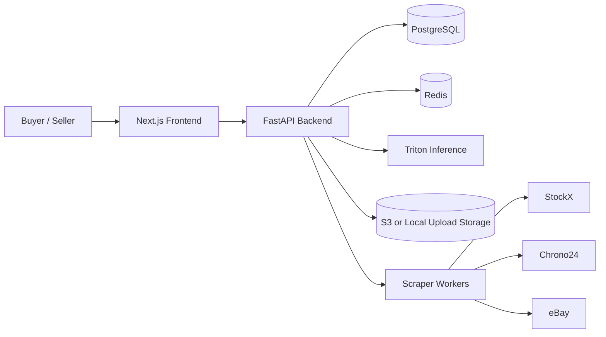
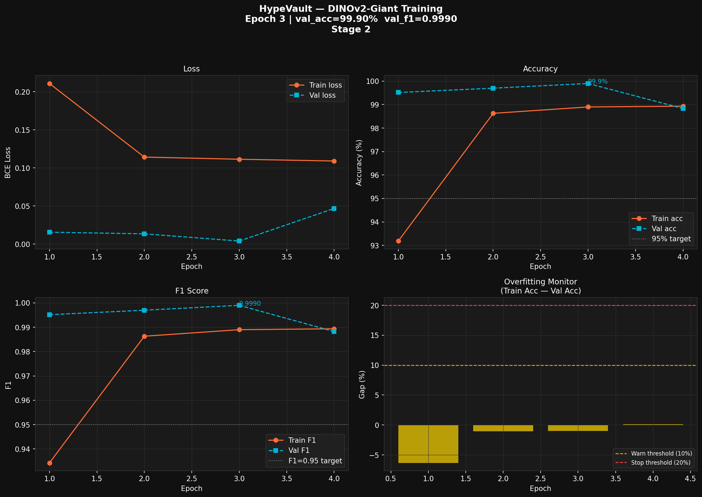
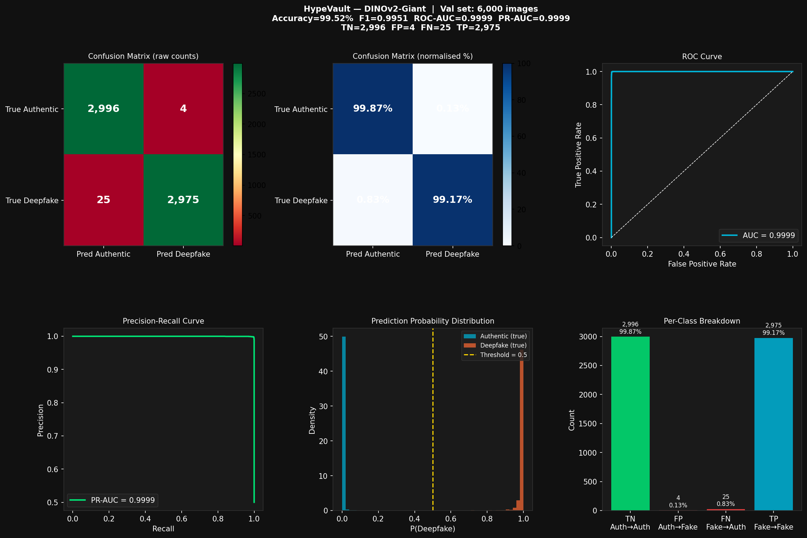
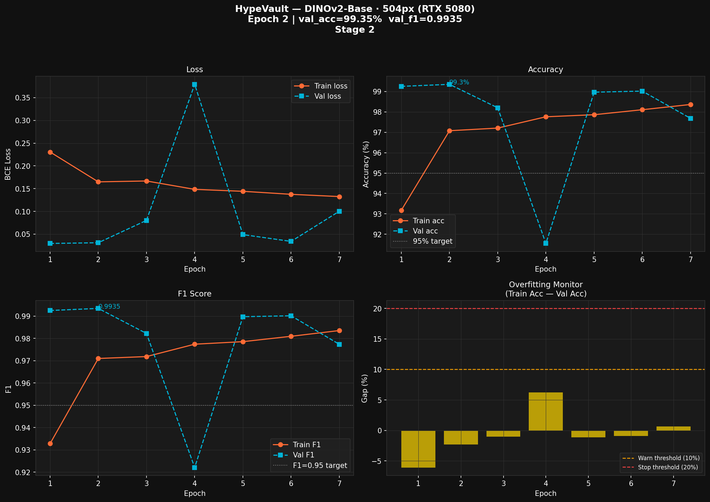

# HypeVault

<p align="center">
  <strong>The AI-Gated Marketplace for Authentic Sneakers and Ultra-Luxury Watches</strong><br/>
  Buy-now experience with AI verification, price intelligence, and seller transparency.
</p>

<p align="center">
  <a href="LICENSE"></a>
  
  
  
  
</p>

<p align="center">
  
  
  
  
  
</p>

---

## Quick Navigation

- [Overview](#overview)
- [Core Capabilities](#core-capabilities)
- [Architecture Snapshot](#architecture-snapshot)
- [Repository Structure](#repository-structure)
- [Quick Start](#quick-start)
- [Command Center by Role](#command-center-by-role)
- [API Surface (Key Routes)](#api-surface-key-routes)
- [Demo Script (Presentation Flow)](#demo-script-presentation-flow)
- [Inference Modes](#inference-modes)
- [Model training results](#model-training-results)
- [Security and Secret Handling](#security-and-secret-handling)
- [Production Notes](#production-notes)
- [License](#license)

---

## Overview

HypeVault is a full-stack marketplace platform focused on trust-first commerce.
Each listing passes through AI verification and pricing intelligence before being surfaced to buyers.

Core principles:
- Verification before visibility
- Comparable market context before purchase
- Production-oriented APIs and operational checks

---

## Core Capabilities

- AI-backed listing verification with Triton or local Torch fallback
- Role-based buyer/seller experiences with JWT session flows
- Google sign-in support (buyer path) plus email/password auth
- Multi-source market comparison (StockX, Chrono24, eBay)
- Cache freshness metadata for comparison responses
- Health, readiness, and metrics endpoints for runtime visibility

---

## Architecture Snapshot



### Frontend
- Next.js 14 App Router
- TypeScript + Tailwind CSS
- TanStack Query + Axios
- Framer Motion + Recharts

### Backend
- FastAPI (async)
- SQLAlchemy 2 + asyncpg
- Redis (auth token rotation + scraper cache)
- Playwright scrapers
- Triton gRPC inference client
- Prometheus metrics endpoint

### Infrastructure
- Docker Compose for local Postgres/Redis/Triton
- ECS/SQS helper assets under `infra/`
- S3 upload flow with local fallback

---

## Repository Structure

```text
backend/      FastAPI app, auth, listings, inference, scraper
frontend/     Next.js UI and client integrations
infra/        Docker and deployment helper artifacts
ml/           Training and model utility scripts (DINOv2-Giant; RTX 6000 Pro Blackwell reference run)
ml_rtx5080/   ViT-B / 504px training pipeline and checkpoints (RTX 5080)
scripts/      Python utilities; optional local *.sh helpers are gitignored
```

---

## Quick Start

### 1) Fast path

From repo root (with Docker running). Shell helpers under `scripts/` are **not** tracked in git; use the manual path below or keep your own local `dev_setup.sh`.

### 2) Manual path (recommended clone)

```bash
python3 -m venv .venv
. .venv/bin/activate
pip install -r requirements.txt
docker compose -f infra/docker-compose.yml up -d postgres redis
cd backend && alembic upgrade head && cd ..
python3 scripts/seed_database.py
```

Start API:

```bash
cd backend
uvicorn main:app --reload --host 0.0.0.0 --port 8000
```

Start frontend:

```bash
cd frontend
npm install
npm run dev
```

Application URLs:
- Frontend: `http://localhost:3000`
- API: `http://localhost:8000`
- Triton gRPC (host): `localhost:18001`

Environment template:
- Copy `.env.example` to `.env` and fill runtime credentials before non-local deployment.

---

## Command Center by Role

<table>
  <tr>
    <td width="33%" valign="top">
      <h3>Developer</h3>
      <p>Run application stack for feature work.</p>
      <pre><code>cd ~/Desktop/HypeVault
python3 -m venv .venv && . .venv/bin/activate
pip install -r requirements.txt
docker compose -f infra/docker-compose.yml up -d postgres redis
cd backend && alembic upgrade head && cd .. && python scripts/seed_database.py
cd backend && uvicorn main:app --reload --host 0.0.0.0 --port 8000
# new terminal
cd frontend && npm install && npm run dev</code></pre>
    </td>
    <td width="33%" valign="top">
      <h3>Infrastructure</h3>
      <p>Bring dependencies and readiness online.</p>
      <pre><code>cd ~/Desktop/HypeVault
docker compose -f infra/docker-compose.yml up -d postgres redis triton
curl -sS http://localhost:8000/health
curl -sS -i http://localhost:8000/health/ready</code></pre>
    </td>
    <td width="33%" valign="top">
      <h3>ML / Inference</h3>
      <p>Export and run model path.</p>
      <pre><code>cd ~/Desktop/HypeVault
. .venv/bin/activate
python scripts/export_tensorrt.py
# fallback mode
export INFERENCE_BACKEND=torch
export LOCAL_MODEL_PATH=models/hypevault_classifier.pt</code></pre>
    </td>
  </tr>
</table>

---

## API Surface (Key Routes)

<details open>
  <summary><strong>Authentication</strong></summary>

- `POST /auth/register`
- `POST /auth/login`
- `POST /auth/google`
- `POST /auth/refresh`
- `POST /auth/logout`
- `GET /auth/me`

</details>

<details open>
  <summary><strong>Verification and Listings</strong></summary>

- `POST /verify/authenticate`
- `POST /listings/`
- `GET /listings/`
- `GET /listings/recent`
- `GET /listings/compare?q=...`
- `GET /listings/{id}/comparison`
- `POST /listings/presign`

</details>

<details>
  <summary><strong>Operations</strong></summary>

- `GET /health`
- `GET /health/ready`
- `GET /metrics`

</details>

---

## Demo Script (Presentation Flow)

Use this minimal runbook for a polished live demo:

1. **Open landing page** and position the narrative: AI-gated trust layer for luxury commerce.
2. **Authenticate as seller**, create/upload listing, run verification.
3. **Show verdict + confidence** and explain gating logic.
4. **Open comparison panel** and highlight cross-market pricing context.
5. **Switch to buyer perspective** and show curated discovery flow.
6. **Close with operations proof** using `GET /health/ready` and `GET /metrics`.

Presentation-ready command block:

```bash
curl -sS http://localhost:8000/health
curl -sS -i http://localhost:8000/health/ready
curl -sS http://localhost:8000/metrics | sed -n '1,20p'
```

---

## Inference Modes

### Triton mode (recommended path)
- Model name: `dinov2_classifier`
- Input tensor: `input__0` shape `[1,3,518,518]` FP32
- See scripts:
  - `scripts/export_tensorrt.py` (when present)
  - optional local `scripts/setup_triton.sh` (not tracked)

### Local Torch fallback
Use when Triton is unavailable:

```bash
pip install -r requirements_inference.txt
```

Then configure in `.env`:
- `INFERENCE_BACKEND=torch`
- `LOCAL_MODEL_PATH=models/hypevault_classifier.pt`
- `DINOV2_MODEL_NAME=dinov2_vitg14_reg`

Switch back to `INFERENCE_BACKEND=triton` for production parity.

---

## Model training results

Binary authenticity classifier: **Authentic (label 0)** vs **Deepfake (label 1)** — see dataset layout in `ml/train.py`.  
Below: **training curves** and **validation confusion-matrix dashboards** for two training setups.

### NVIDIA RTX 6000 Pro Blackwell (`ml/`)

Full fine-tune pipeline (**DINOv2-Giant**, Stage 2). Validation eval figure summarizes ~**6,000** held-out images (Authentic vs Deepfake).

<p align="center">
  
</p>

<p align="center">
  
</p>

### NVIDIA GeForce RTX 5080 (`ml_rtx5080/`)

Smaller backbone / resolution run (see `ml_rtx5080/train.py`).

<p align="center">
  
</p>

<p align="center">
  
</p>

> Checkpoint weights (`.pt`, `.onnx`, etc.) stay **gitignored**; only these PNG artifacts are tracked for documentation.

---

## Security and Secret Handling

- Never commit secrets.
- Keep runtime values in environment variables only.
- Use a local env template (keep secrets out of git).
- `.gitignore` is configured to exclude:
  - `.env*` and `.env.example`
  - key/cert artifacts
  - service-account JSON files
  - heavyweight training and dataset folders

Before each push:
- verify no secret-bearing files are staged
- keep machine-specific `.env` and credential material local-only

---

## Production Notes

- Prefer S3 pre-signed uploads via `POST /listings/presign`
- Ensure Redis is healthy for token rotation and cache paths
- Treat external scraping as best-effort and failure-tolerant
- Monitor readiness and metrics before exposing user traffic
- Keep Triton model readiness green before enabling verification-dependent flows

---

## License

MIT License. See `LICENSE`.
