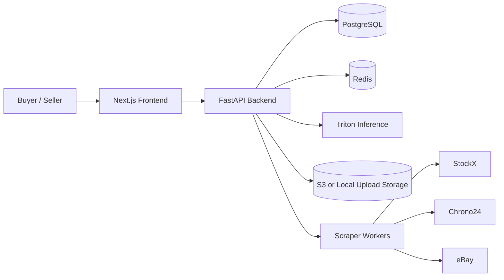

# HypeVault

<p align="center">
  <strong>The AI-Gated Marketplace for Authentic Sneakers and Ultra-Luxury Watches</strong><br/>
  Buy-now experience with AI verification, price intelligence, and seller transparency.
</p>

<p align="center">
  <a href="LICENSE"></a>
  
  
  
  
</p>

---

## Quick Navigation

- [Overview](#overview)
- [Core Capabilities](#core-capabilities)
- [Architecture Snapshot](#architecture-snapshot)
- [Repository Structure](#repository-structure)
- [Quick Start](#quick-start)
- [API Surface (Key Routes)](#api-surface-key-routes)
- [Inference Modes](#inference-modes)
- [Security and Secret Handling](#security-and-secret-handling)
- [Superpowers and Agent Skills](#superpowers-and-agent-skills)
- [Production Notes](#production-notes)
- [License](#license)

---

## Overview

HypeVault is a full-stack marketplace platform focused on trust-first commerce.
Each listing passes through AI verification and pricing intelligence before being surfaced to buyers.

Core principles:
- Verification before visibility
- Comparable market context before purchase
- Production-oriented APIs and operational checks

---

## Core Capabilities

- AI-backed listing verification with Triton or local Torch fallback
- Role-based buyer/seller experiences with JWT session flows
- Google sign-in support (buyer path) plus email/password auth
- Multi-source market comparison (StockX, Chrono24, eBay)
- Cache freshness metadata for comparison responses
- Health, readiness, and metrics endpoints for runtime visibility

---

## Architecture Snapshot



### Frontend
- Next.js 14 App Router
- TypeScript + Tailwind CSS
- TanStack Query + Axios
- Framer Motion + Recharts

### Backend
- FastAPI (async)
- SQLAlchemy 2 + asyncpg
- Redis (auth token rotation + scraper cache)
- Playwright scrapers
- Triton gRPC inference client
- Prometheus metrics endpoint

### Infrastructure
- Docker Compose for local Postgres/Redis/Triton
- ECS/SQS helper assets under `infra/`
- S3 upload flow with local fallback

---

## Repository Structure

```text
backend/      FastAPI app, auth, listings, inference, scraper
frontend/     Next.js UI and client integrations
infra/        Docker and deployment helper artifacts
ml/           Training and model utility scripts
scripts/      Setup, export, seed, and local automation scripts
```

---

## Quick Start

### 1) Fast path

From repo root (with Docker running):

```bash
bash scripts/dev_setup.sh
```

This script:
- creates `.venv`
- installs Python dependencies
- starts Postgres + Redis
- runs Alembic migrations
- seeds initial data

### 2) Manual path

If you prefer manual setup:

```bash
python3 -m venv .venv
. .venv/bin/activate
pip install -r requirements.txt
docker compose -f infra/docker-compose.yml up -d postgres redis
cd backend && alembic upgrade head && cd ..
python3 scripts/seed_database.py
```

Start API:

```bash
cd backend
uvicorn main:app --reload --host 0.0.0.0 --port 8000
```

Start frontend:

```bash
cd frontend
npm install
npm run dev
```

Application URLs:
- Frontend: `http://localhost:3000`
- API: `http://localhost:8000`
- Triton gRPC (host): `localhost:18001`

Environment template:
- Copy `.env.example` to `.env` and fill runtime credentials before non-local deployment.

---

## API Surface (Key Routes)

### Authentication
- `POST /auth/register`
- `POST /auth/login`
- `POST /auth/google`
- `POST /auth/refresh`
- `POST /auth/logout`
- `GET /auth/me`

### Verification and Listings
- `POST /verify/authenticate`
- `POST /listings/`
- `GET /listings/`
- `GET /listings/recent`
- `GET /listings/compare?q=...`
- `GET /listings/{id}/comparison`
- `POST /listings/presign`

### Operations
- `GET /health`
- `GET /health/ready`
- `GET /metrics`

---

## Inference Modes

### Triton mode (recommended path)
- Model name: `dinov2_classifier`
- Input tensor: `input__0` shape `[1,3,518,518]` FP32
- See scripts:
  - `scripts/export_tensorrt.py`
  - `scripts/setup_triton.sh`

### Local Torch fallback
Use when Triton is unavailable:

```bash
pip install -r requirements_inference.txt
```

Then configure in `.env`:
- `INFERENCE_BACKEND=torch`
- `LOCAL_MODEL_PATH=models/hypevault_classifier.pt`
- `DINOV2_MODEL_NAME=dinov2_vitg14_reg`

Switch back to `INFERENCE_BACKEND=triton` for production parity.

---

## Security and Secret Handling

- Never commit secrets.
- Keep runtime values in environment variables only.
- Use `.env.example` as the template.
- `.gitignore` is configured to exclude:
  - `.env*` (except `.env.example`)
  - key/cert artifacts
  - service-account JSON files
  - heavyweight training and dataset folders

Before each push:
- verify no secret-bearing files are staged
- keep machine-specific `.env` and credential material local-only

---

## Superpowers and Agent Skills

The npm package `@obra/superpowers` is not published; Superpowers is distributed as a plugin and skill library:
- Cursor install: `/add-plugin superpowers` or marketplace
- Offline bootstrap: `scripts/bootstrap_superpowers.sh`

Domain skills for this repository are under `.cursor/skills/`:
- `authentication.md`
- `dinov2_inference.md`
- `playwright_scraper.md`
- `price_dashboard.md`
- `image_upload.md`
- `aws_infra.md`

---

## Production Notes

- Prefer S3 pre-signed uploads via `POST /listings/presign`
- Ensure Redis is healthy for token rotation and cache paths
- Treat external scraping as best-effort and failure-tolerant
- Monitor readiness and metrics before exposing user traffic
- Keep Triton model readiness green before enabling verification-dependent flows

---

## License

MIT License. See `LICENSE`.
